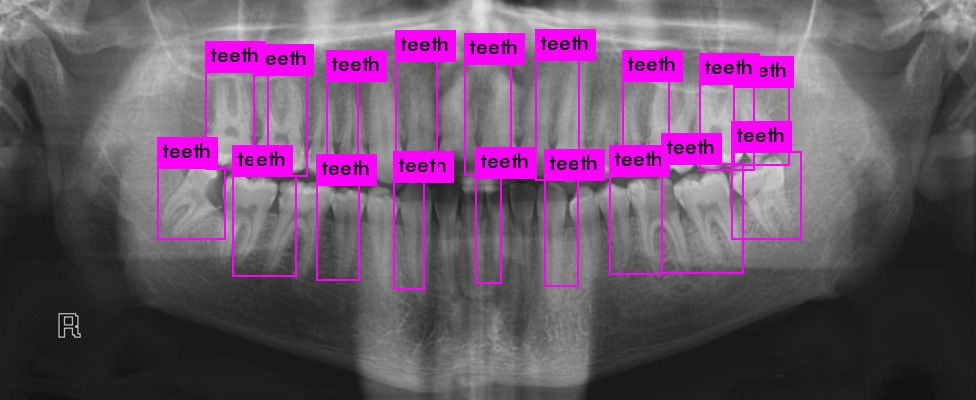

# Dental-Biometrics
Person Identification based on dental records using Neural Networks

# Custom Yolo Teeth Detection Output

How it works?
1. read an input dental xray image
2. Use Yolo Object detection to detect teeth
3. Extract the detected teeth and pass it on to a classifier written in Pytorch to obtain classified images.
4. Now we have all the teeth extracted and correctly classified
5. Using OpenCV try to match individual teeth with the existing data from the collected dataset
6. Generate Class Scores to predict the person or generate a list of matching people and display their details.
